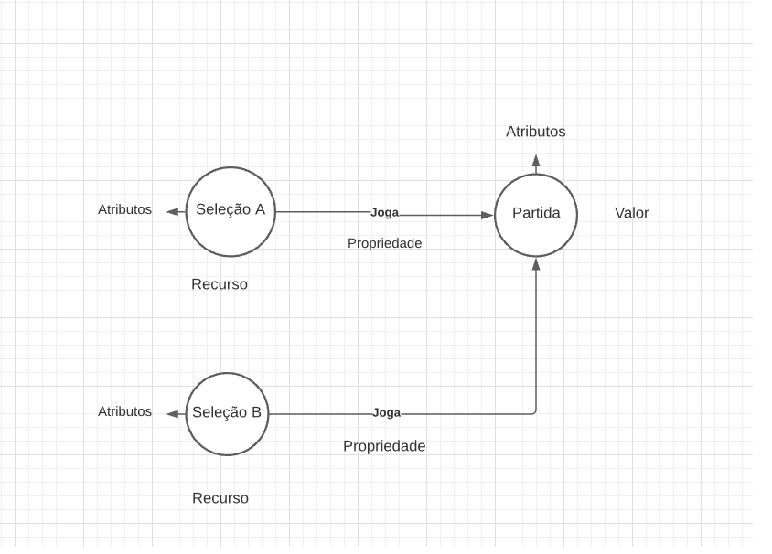

# Modelo para Apresentação do Lab09 - Grafo de Conhecimento

Estrutura de pastas:

~~~
├── README.md  <- arquivo apresentando a tarefa
│
└── images     <- arquivos de imagem usados na tarefa
~~~

# Aluno
* 213259 : Arthur Cemin Baia

## Exemplo de Grafo de Conhecimento - para publicar ou enriquecer
> Utilize a abordagem (recurso, propriedade, valor) para apresentar seu grafo exemplo.
> Coloque a imagem do PNG do seu modelo lógico como ilustrado abaixo (a imagem estará na pasta `image).
>
> Você pode usar um grafo ilustrando as classes, como este:
> 
>
> Além de outro com exemplo de instâncias, como este:
> 

A representação na forma de triplas é opcional.

## Perguntas de Pesquisa ou Queries

> Liste aqui as três perguntas de pesquisa ou queries
> * Pergunta 1 *
Qual é as seleções que jogaram mais vezes entre si na história da copa do mundo feminina?
> * Pergunta 2 *
Qual é o placar mais comum entre todas as partidas?
> * Pergunta 3 *
Dentre as seleções vencedoras da partidas, qual é a formação mais utilizada?